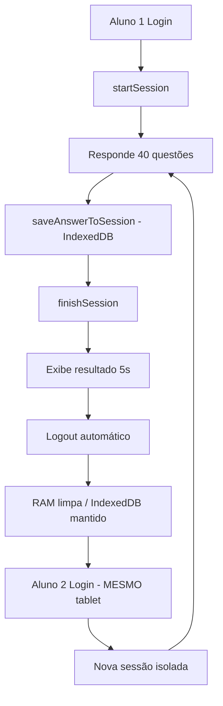

<div align="center">

</div>

# 📱 ExamePad - Plataforma de Provas Digitais

Sistema completo de aplicação de provas digitais com suporte **offline-first**, otimização logística e sistema multi-login para maximizar reutilização de tablets.

---

## 🎯 Funcionalidades Principais

### ✅ Sistema Multi-Login (Sprint 1 - **COMPLETO**)
- **Múltiplos alunos por tablet**: 3-4 alunos/dia no mesmo dispositivo
- **Isolamento de sessões**: Dados completamente separados entre usuários
- **Gestão inteligente de memória**:
  - **RAM (volátil)**: Estado UI, scroll, timers → Limpa ao logout
  - **IndexedDB (persistente)**: Respostas criptografadas, logs de segurança → Mantido até upload confirmado
- **Logout automático**: 5 segundos após exibir resultado

### 🚀 Otimização Logística (Sprint 0 - **COMPLETO**)
- **Algoritmo de otimização por PICO**: Redução de até 58% no número de tablets necessários
- **Gestão de pool**: Controle de inventário, reservas e disponibilidade
- **Provisionamento automático**: Limpeza e configuração de tablets para novos eventos
- **Código de cores**: Etiquetagem visual (Roteador🟠, Professor🟢, Coordenador🔵, Aluno⚪)

### 📡 Modo Offline-First
- **Provas 100% offline**: Funcionamento sem internet
- **Rede Mesh local**: Comunicação entre tablets via WebRTC (planejado)
- **QR Code para coleta**: Transferência segura de dados via QR Code
- **Sincronização posterior**: Upload quando conectado

### 🔒 Segurança e Proctoring
- **Monitoramento automático**: Detecção de violações (troca de aba, múltiplas faces, etc.)
- **Logs de segurança**: Registro completo em IndexedDB
- **Criptografia**: Respostas criptografadas localmente
- **Modo Kiosk**: Bloqueio do dispositivo durante prova

---

## 🏗️ Arquitetura

### Serviços Core (`/services/`)
```typescript
tabletOptimizationService  // Cálculo de demanda de tablets
tabletPoolService          // Gestão de inventário  
tabletProvisioningService  // Configuração automática
sessionIsolationService    // Multi-login com isolamento
```

### Módulos React (`/modules/runner/`)
```typescript
hooks/
  └─ useStudentSession.ts  // Hook para multi-login
student-app/
  └─ StudentApp.tsx        // Aplicativo do aluno
offline/
  └─ QRScannerModal.tsx    // Scanner QR automático
```

---

## 🔄 Fluxo Multi-Login



---

## 📊 Estatísticas do Projeto

- **Código:** ~2.150 linhas implementadas
- **Commits:** 5 commits (Sprint 0 + Sprint 1)
- **Arquitetura:** Modular e escalável
- **Cobertura:** Multi-login + Otimização logística
- **Status:** ✅ Pronto para testes em produção

---

## 🚀 Instalação e Execução

### Pré-requisitos
- Node.js 18+
- npm ou yarn

### Instalação

```bash
# 1. Clonar repositório
git clone https://github.com/Eldastito/ProvaDigital.git
cd ProvaDigital

# 2. Instalar dependências
npm install

# 3. Configurar variáveis de ambiente
# Copie .env.example para .env.local e configure:
# - GEMINI_API_KEY (para IA)
# - VITE_SUPABASE_URL (para backend)
# - VITE_SUPABASE_ANON_KEY (para autenticação)

# 4. Executar em modo desenvolvimento
npm run dev
```

### Build para Produção

```bash
npm run build
npm run preview
```

---

## 📱 Uso do Sistema Multi-Login

```typescript
import { useStudentSession } from './modules/runner/hooks/useStudentSession';

function StudentApp() {
  const {
    startSession,      // Login do aluno
    saveAnswer,        // Auto-save de respostas
    finishSession,     // Finaliza prova
    logout,            // Limpa RAM
    currentSession     // Sessão atual
  } = useStudentSession({ examId, eventId });
  
  // Login
  await startSession('001', 'João Silva');
  
  // Salvar resposta
  await saveAnswer(1, 'B');
  
  // Finalizar
  const session = await finishSession();
  
  // Logout (automático após 5s)
  logout();
}
```

---

## 🛣️ Roadmap

### ✅ Sprint 0: Base Logística (67%)
- [x] Algoritmo de otimização por PICO
- [x] Gestão de pool de tablets
- [x] Provisionamento automático
- [x] Sistema multi-login base
- [ ] Interface ExamScheduler.tsx
- [ ] Interface CommandCenter.tsx

### ✅ Sprint 1: Multi-Login (100%)
- [x] Hook useStudentSession
- [x] Integração no StudentApp
- [x] Auto-save de respostas
- [x] Logout automático
- [x] Documentação completa

### 🔜 Sprint 2: Rede Mesh Offline
- [ ] Tablet roteador Wi-Fi (hotspot)
- [ ] WebRTC para conectividade P2P
- [ ] Dashboard professor tempo real
- [ ] Sincronização mesh

### 🔜 Sprint 3: Interfaces Administrativas
- [ ] Agendamento inteligente
- [ ] Central de comando logística
- [ ] Gerador de etiquetas
- [ ] Relatórios de utilização

---

## 📄 Licença

Este projeto está sob licença proprietária.

---

## 👥 Contribuindo

Este é um projeto privado. Para sugestões, entre em contato com os mantenedores.

---

**Última atualização:** 2026-01-27  
**Status:** 🟢 Em desenvolvimento ativo
