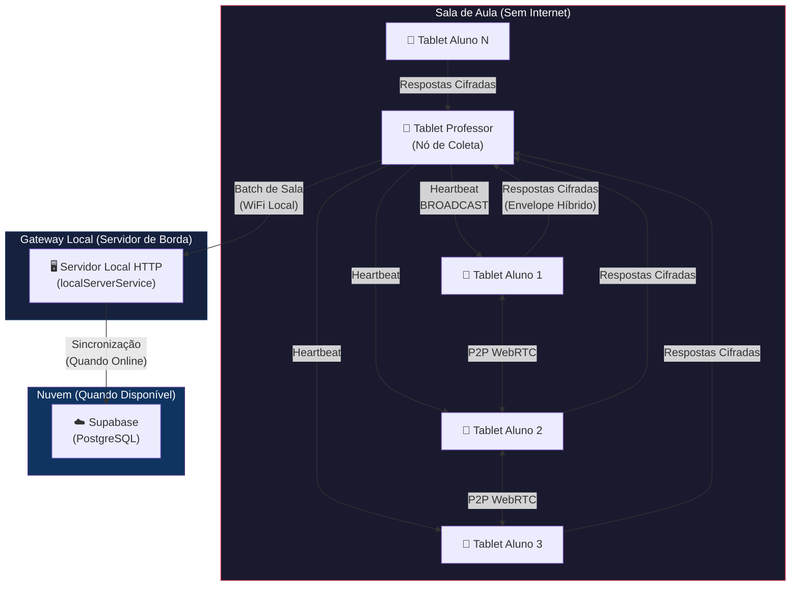
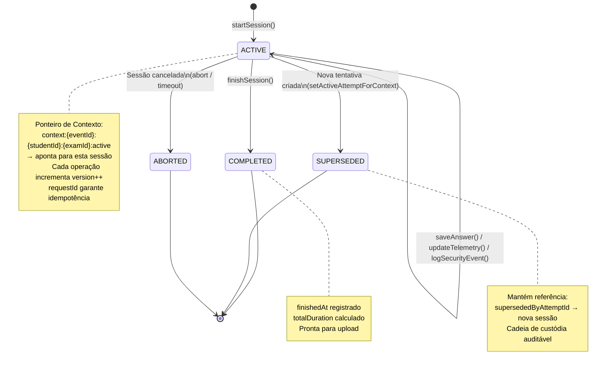
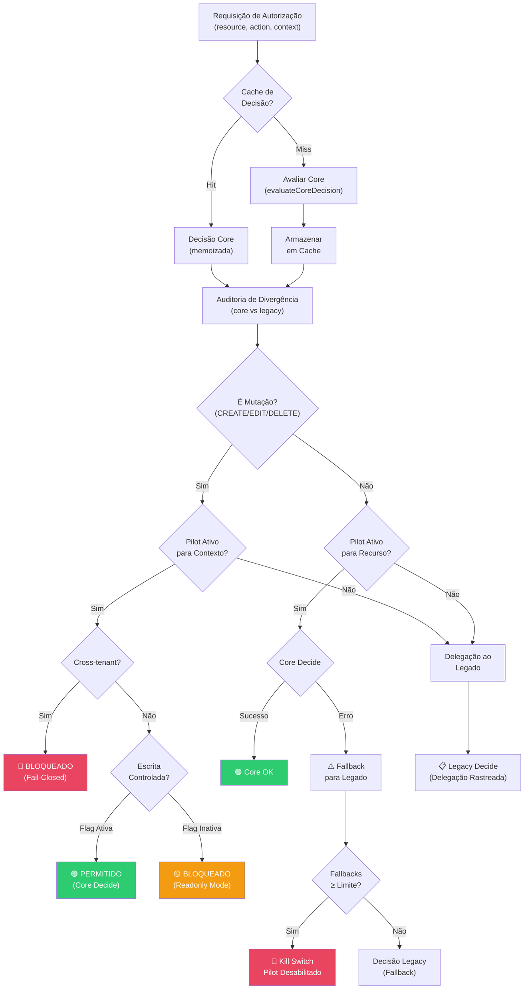

# Diagramas Técnicos — Patente FORGE

Diagramas de referência para o pedido de Patente de Invenção (PI) da plataforma FORGE.

---

## Figura 1: Topologia Mesh — Fluxo de Dados na Rede Local

**Legenda**: Dados trafegam cifrados (payload AES-256-GCM) pela rede mesh. O header da mensagem permanece aberto apenas para roteamento. O servidor local opera como buffer temporário até a sincronização com a nuvem.

---

## Figura 2: Cold Boot — Diagrama de Estados do Ciclo de Vida da Sessão

**Legenda**: A sessão inicia no estado ACTIVE com um Context Pointer canônico. Transições são unidirecionais e auditáveis. Estados SUPERSEDED, COMPLETED e ABORTED são terminais.

---

## Figura 3: Envelope Híbrido — Fluxo de Cifra e Assinatura

```mermaid
flowchart LR
    subgraph ORIGEM["Dispositivo de Origem (Aluno)"]
        R["Respostas\n(plaintext)"]
        
        R --> DK["Derivação de Chave\n(PBKDF2 SHA-256)"]
        DK --> ENC["Cifra\n(AES-256-GCM + IV)"]
        ENC --> EP["Pacote Cifrado\n{iv, data}"]
        
        EP --> ENV["Montagem do\nEnvelope Híbrido"]
        
        META["Metadados\n(type, from, to)"] --> ENV
        
        ENV --> SIGN["Assinatura HMAC\n(SHA-256)"]
    end
    
    subgraph TRANSPORTE["Rede Mesh P2P"]
        MSG["MeshHybridEnvelope\n─────────────\n📋 Header (aberto)\n  type: ANSWER\n  from: student_1\n  to: BROADCAST\n  messageId: uuid\n─────────────\n🔒 Payload (cifrado)\n  iv: base64...\n  data: base64...\n─────────────\n✅ Signature\n  HMAC: base64..."]
    end
    
    SIGN --> MSG
    
    subgraph DESTINO["Dispositivo de Destino (Professor)"]
        VER["Verificação HMAC\n(Integridade)"]
        STORE["Armazena\n(NÃO descriptografa)"]
        
        MSG --> VER
        VER -->|"OK"| STORE
        VER -->|"FALHA"| REJ["❌ Rejeitado\n(Adulteração)"]
    end
    
    subgraph CONSOLIDACAO["Servidor (Consolidação)"]
        DK2["Derivação de Chave\n(mesmos parâmetros)"]
        DEC["Decifra\n(AES-256-GCM)"]
        RESULT["Resultado\nProcessado"]
        
        STORE -->|"Upload"| DK2
        DK2 --> DEC
        DEC --> RESULT
    end
    
    style ORIGEM fill:#1a1a2e,stroke:#e94560,color:#fff
    style TRANSPORTE fill:#16213e,stroke:#fca311,color:#fff
    style DESTINO fill:#0f3460,stroke:#0f3460,color:#fff
    style CONSOLIDACAO fill:#533483,stroke:#533483,color:#fff
```

**Legenda**: As respostas são cifradas na origem com chave derivada do par (aluno+evento). O professor armazena o pacote cifrado sem descriptografá-lo. Apenas o servidor de consolidação (com acesso aos mesmos parâmetros de derivação) pode descriptografar.

---

## Figura 4: Authority Pilot — Fluxo de Decisão

**Legenda**: O motor de autorização opera em três modos: Shadow (ambos avaliam, legado decide), Pilot (core decide para whitelist), Kill Switch (retorno automático ao legado). Mutações cross-tenant são sempre bloqueadas (fail-closed).
